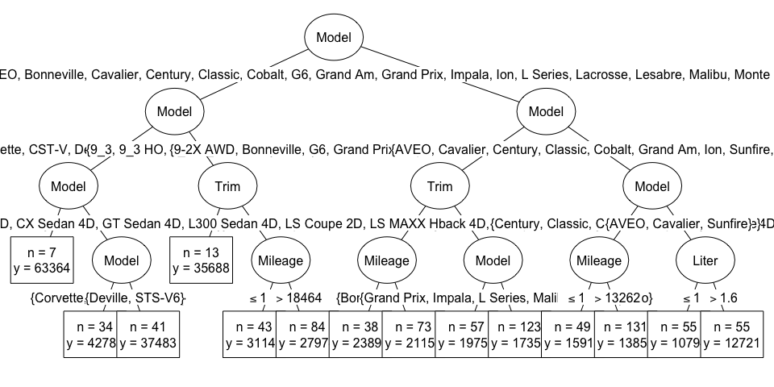
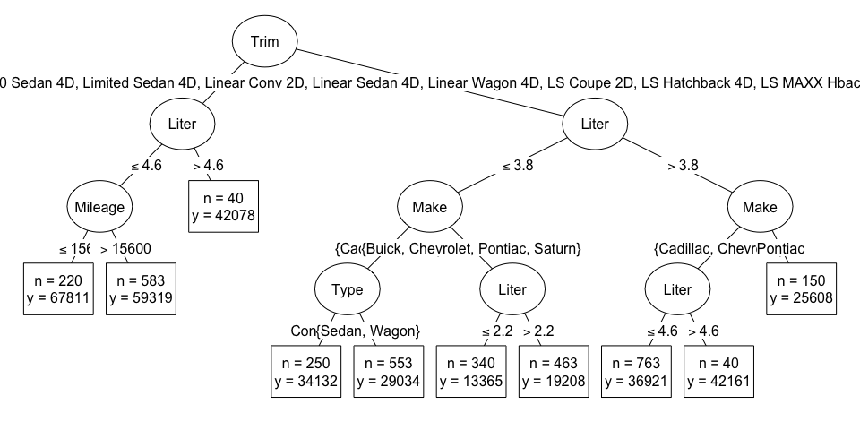
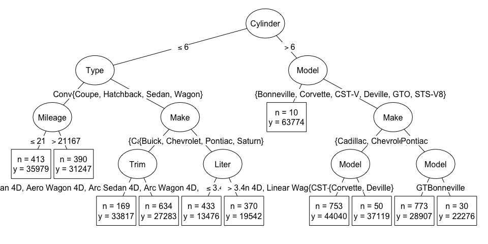
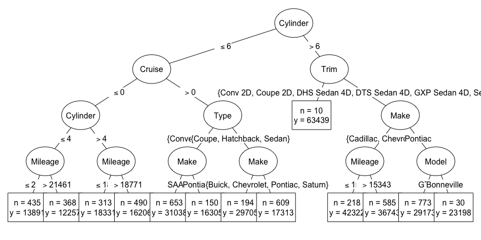
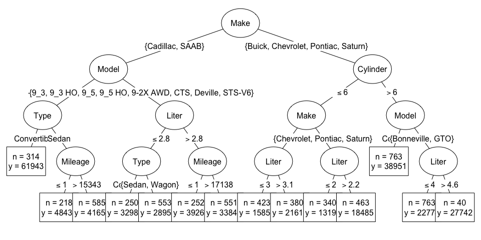

# Regression Tree Models Tutorial
Lauren Savage  

Welcome to the regression tree models tutorial!  Even if you've used a tree-based model before like random forest, you might have never thought about all the details that go into building a model.  The goal of this tutorial is to start with the basic building blocks and work up from there.  Each section will include snippets of R code so that you can get hands-on experience.  Even though we focus on regression problems, these concepts work for classification as well.

*Table of Contents*

* [Regression Trees](#regression-trees)
 * [Example Regression Tree](#example-regression-tree)
 * [Choosing Splits](#choosing-splits)
   - [CART](#cart)
    * [Conditional Inference](#conditional-inference)
 * [Regression Trees vs Linear Regression](#regression-trees-vs-linear-regression)
* [Random Forest](#random-forest)
 * [Bagged Regression Trees](#bagged-regression-trees)
 * [Random Forest](#random-forest-1)
 * [Out-of-bag (OOB) Samples](#out-of-bag-oob-samples)
 * [Tuning Parameters](#tuning-parameters)
* [Summary](#summary)
* [Acknowledgements](#acknowledgements)


# Regression Trees

Classification models predict categorical outcomes (e.g. success/failure), whereas regression models predict continuous variables.

We'll be using an example dataset from Kelly Blue Book 2005 to predict the prices of used cars.  Since price is continuous, this is a regression problem. 


```r
cars.df <- read.csv("kelly_blue_book_2005.csv", header = TRUE, stringsAsFactors = TRUE)
head(cars.df)
```

```
##      Price Mileage  Make   Model     Trim  Type Cylinder Liter Doors
## 1 17314.10    8221 Buick Century Sedan 4D Sedan        6   3.1     4
## 2 17542.04    9135 Buick Century Sedan 4D Sedan        6   3.1     4
## 3 16218.85   13196 Buick Century Sedan 4D Sedan        6   3.1     4
## 4 16336.91   16342 Buick Century Sedan 4D Sedan        6   3.1     4
## 5 16339.17   19832 Buick Century Sedan 4D Sedan        6   3.1     4
## 6 15709.05   22236 Buick Century Sedan 4D Sedan        6   3.1     4
##   Cruise Sound Leather
## 1      1     1       1
## 2      1     1       0
## 3      1     1       0
## 4      1     0       0
## 5      1     0       1
## 6      1     1       0
```

The goal of a tree is to split the data into groups that are similar with respect to the response.  This is done by creating binary splits one variable at a time.

## Example Regression Tree

The regression tree below was grown using Pontiacs from our used car dataset.


```r
pontiac.df <- subset(cars.df, Make == "Pontiac")
one_tree <- ctree(Price ~ Mileage + Type + Cylinder + Doors + Cruise + Sound + Leather, 
                  data = pontiac.df, 
                  controls = ctree_control(maxdepth = 3))
plot(one_tree, inner_panel = node_inner(one_tree, pval = FALSE, id = FALSE))
```

<!-- -->

We can see that the regression tree has successfully split Pontiacs into groups with different prices.  For example, Pontiacs with > 6 cylinders and of type coupe (in Node 10) had prices around $30,000, but Pontiacs with <= 6 cylinders, <= 4 cylinders, and <= 2 doors (in Node 4) had prices around $12,500.  Notice that the tree split twice on the same variable, cylinder, which is okay.

This tree can be used to predict the prices of new records by following the splits to the corresponding terminal nodes.  The prediction is the average price of cars in the terminal node.  For example, this tree will predict that any sedans with > 6 cylinders have a price of $22,578.

## Choosing Splits

At each node, the tree-building algorithm searches through each variable for the "best" split and then chooses the "best" variable to split on, where the definition of "best" depends on the methodology.

### CART

(Implemented in the rpart package.)

The best split minimizes the sum of squares error.  This is a way of quanitifying how far the true responses are from the predicted response, the average at each node. The formula for sum of squares error is:

$$ SSE = \sum\nolimits_{i \in S_1} (y_i - \bar{y}_1)^2 + \sum\nolimits_{i \in S_2} (y_i - \bar{y}_2)^2$$

Let's look at how CART would choose the best split for mileage on a group of Buick Lacrosses.


```r
lacrosse.df <- subset(cars.df, Model == "Lacrosse")
ggplot(lacrosse.df, aes(y = Price/1000, x = Mileage)) + 
        geom_point() + theme_bw()
```

<!-- -->

We can see that there's some relationship between mileage and price, where lower mileage cars tend to be more expensive.

Let's calculate the sum of squares error for each potential split on mileage.


```r
n_cars <- nrow(lacrosse.df)
# The potential splits are all the values of Mileage found in the dataset.
# Create dataframe to store all potential splits, their associated sum of squares
# error (SSE), and the predictions for the left and right groups after the split.
SSE.df <- data.frame(Mileage = sort(lacrosse.df$Mileage), 
                     SSE = numeric(n_cars), 
                     left_mean = numeric(n_cars), 
                     right_mean = numeric(n_cars))
for(i in 1:n_cars){
    mileage <- SSE.df$Mileage[i]
    # split cars into left and right groups by mileage
    left.df <- lacrosse.df[lacrosse.df$Mileage <= mileage,]
    right.df <- lacrosse.df[lacrosse.df$Mileage > mileage,]
    # calculate left and right predictions/means
    SSE.df$left_mean[i] <- mean(left.df$Price)
    SSE.df$right_mean[i] <- mean(right.df$Price)
    # calculate sum of squares error
    SSE.df$SSE[i] <- sum((left.df$Price - SSE.df$left_mean[i])^2) + 
        sum((right.df$Price - SSE.df$right_mean[i])^2)
}
# plot the SSE for each split on mileage
ggplot(SSE.df, aes(x = Mileage, y = SSE/1000000)) + geom_line() + theme_bw()
```

<!-- -->

We obtain the minimum sum of squares error when we split on mileage <= 19,467.

Let's see what this split looks like. The predictions for the two groups are in red.


```r
# the best split is the mileage with the minimum SSE
best_split.df <- SSE.df[which.min(SSE.df$SSE),]
# create datasets with points to plot red lines for the left and right means
left_mean.df <- data.frame(x = c(-Inf, best_split.df$Mileage), 
                          y = rep(best_split.df$left_mean, 2))
right_mean.df <- data.frame(x = c(best_split.df$Mileage, Inf), 
                          y = rep(best_split.df$right_mean, 2))
ggplot(lacrosse.df, aes(y = Price/1000, x = Mileage)) + 
        geom_point() + theme_bw() + 
        geom_vline(xintercept = best_split.df$Mileage) +
        geom_line(data = left_mean.df, aes(x = x, y = y/1000), color = "red") +
        geom_line(data = right_mean.df, aes(x = x, y = y/1000), color = "red")
```

<!-- -->

There's a second commonly used method for choosing the best split...

### Conditional Inference

(Implemented in the party package.)

This algorithm conducts statistical tests for each possible split and chooses the best split as the one with the smallest p-value.

## Regression Trees vs Linear Regression

Let's take a moment to consider the advantages and disadvantages of single regression trees compared to another popular approach, linear regression.

* Trees can model complicated interactions while linear regression mostly models main effects (unless interaction terms are added)
* Linear regression requires strict assumptions of linearity, additivity, and normality while trees require no such assumptions
* A single tree is unstable - removing just one record can change the entire structure
* A single tree can only predict a few values (for example, the first tree we grew only had 6 terminal nodes, so it could only make 6 different predictions)

The solution to several of the problems with single trees is an ensemble model, such as...

# Random Forest

What if we could average together many different regression trees to get a more stable, nuanced model?

## Bagged Regression Trees

Bagging is short for **b**ootstrap **agg**regation.  This is an ensemble method wherein many different trees are grown using bootstrap samples of the original dataset.  (Bootstrap sampling is just random sampling *with* replacement.)  Predictions of each tree are averaged to create aggregate predictions.  Averaging together creates predictions with lower variance than predictions from a single tree.

Let's create our own bagged model with 4 trees (typically you would grow many more trees) and limit the trees to a depth of 4 so that we can easily plot them.  We'll set aside the first row of our dataset to make predictions on.


```r
# set aside first row
(cars_first.df <- cars.df[1,])
```

```
##     Price Mileage  Make   Model     Trim  Type Cylinder Liter Doors Cruise
## 1 17314.1    8221 Buick Century Sedan 4D Sedan        6   3.1     4      1
##   Sound Leather
## 1     1       1
```

```r
cars_minus_first.df <- cars.df[-1,]
n_samples <- nrow(cars_minus_first.df)
n_trees <- 4
max_depth <- 4
predictions <- numeric(n_trees)
set.seed(235)
for(i in 1:n_trees){
    # create bootstrap sample (sample with replacement, same size as original)
    cars_bootstrap.df <- cars_minus_first.df[sample(1:n_samples, n_samples, replace = TRUE),]
    # grow conditional inference tree - ctree() from party package
    one_tree <- ctree(Price ~ Mileage + Make + Model + Trim + Type + Cylinder + 
                          Liter + Doors + Cruise + Sound + Leather, 
                  data = cars_bootstrap.df, 
                  controls = ctree_control(maxdepth = max_depth))
    # plot tree using options to make tree more compact
    plot(one_tree, type="simple", 
         inner_panel = node_inner(one_tree, pval = FALSE, id = FALSE), 
         terminal_panel = node_terminal(one_tree, digits = 0, fill = c("white"), id = FALSE))
    # predict the price of the held out record
    predictions[i] <- predict(one_tree, cars_first.df)
    print(paste("Prediction of single tree for the held out record:", format(predictions[i], digits=0)))
}
```

<!-- -->

```
## [1] "Prediction of single tree for the held out record: 15117"
```

<!-- -->

```
## [1] "Prediction of single tree for the held out record: 15729"
```

<!-- -->

```
## [1] "Prediction of single tree for the held out record: 15918"
```

<!-- -->

```
## [1] "Prediction of single tree for the held out record: 13287"
```

You can follow each tree's splits to see why it's making the prediction it is for the held out record.  To get the aggregate prediction, we average together all 4 values:


```r
mean(predictions)
```

```
## [1] 15012.78
```

Bagged trees are a great improvement over a single tree, but maybe we can still improve the bagged model...

## Random Forest

Notice that the structure of the above trees is the same.  Each tree splits on Model first because it's the most important variable.  Because Model dominates, it's hard for our trees to learn from any other variables.  These trees are highly correlated, so we haven't taken full advantage of aggregation to make a more stable model.

Random forest introduces another element of randomness.  At each split, only some variables are considered for splitting. In our example, this means Model won't always be the first split.


```r
set.seed(903)
# cforest() from the party package grows a forest of conditional inference trees
# we use the same number of trees and depth as our previous bagged model
cars.rf <- cforest(Price ~ Mileage + Make + Model + Trim + Type + Cylinder + 
                          Liter + Doors + Cruise + Sound + Leather, 
                  data = cars_minus_first.df, 
                  controls = cforest_control(ntree = n_trees, maxdepth = max_depth))
# plot each tree grown by cforest()
for(i in 1:n_trees){
    # see Acknowledgements section for functions to grab individual trees from cforest()
    one_tree <- get_cTree(cars.rf, i) 
    plot(one_tree, type="simple", 
         inner_panel = node_inner(one_tree, pval = FALSE, id = FALSE), 
         terminal_panel = node_terminal(one_tree, digits = 0, fill = c("white"), id = FALSE))    
}
```

<!-- --><!-- --><!-- --><!-- -->

Notice how different each of these trees are! 


```r
# predict the price of the held out record 
predict(cars.rf, cars_first.df, OOB = FALSE)
```

```
##         Price
## [1,] 16668.64
```

Our random forest predicts that the price of the first record will be $16,668.

## Out-of-bag (OOB) Samples

One advantage of bagged trees and random forest is that each tree is grown using only a subset of the original dataset.  On average, about 63% of records in the original dataset end up in a bootstrap sample.  Because the other 37% (the out-of-bag samples) aren't seen by the tree at all, they can be used to produce performance metric for that tree.

Let's see how this works with a single tree. 


```r
# create bootstrap sample and out-of-bag sample
n_samples <- nrow(cars.df)
set.seed(348)
bootstrap_index <- sample(1:n_samples, n_samples, replace = TRUE)
cars_bootstrap.df <- cars.df[bootstrap_index,]
cars_oob.df <- cars.df[-bootstrap_index,]
# grow tree
one_tree <- ctree(Price ~ Mileage + Make + Model + Trim + Type + Cylinder + 
                      Liter + Doors + Cruise + Sound + Leather, 
                  data = cars_bootstrap.df, 
                  controls = ctree_control(maxdepth = 4))
# find percent oob sample
nrow(cars_oob.df)/n_samples
```

```
## [1] 0.3731343
```

The OOB sample is 37% of the original dataset, as we expected.

Now we can predict the price of each OOB sample and calculate a performance metric for that tree.  We'll use root mean square error.


```r
cars_oob.df$prediction <- predict(one_tree, cars_oob.df)
sqrt(sum((cars_oob.df$prediction - cars_oob.df$Price)^2)/nrow(cars_oob.df))
```

```
## [1] 2363.479
```

This is the root mean square error for a single tree.  Let's say we had a bagged tree model or random forest.  For each record, we could make predictions using only trees for which that record is an out-of-bag sample (i.e. trees that have never seen that record).  If we calculated the root mean square error using these predictions, we would have an estimate of the performance of the entire forest.  

This estimate would be useful if we wanted to compare different models...

## Tuning Parameters

Our random forest model had 4 trees with max depth of 4.  Number of trees and max depth are examples of tuning parameters.  These were actually bad choices for getting the most accurate predictions, but good choices to save you scrolling past hundreds of trees when we visualized the forest.  In everyday practice, your random forests will have many more trees and be much deeper.

But how do you know if you've chosen "good" tuning parameters?  We can use OOB samples to compare the performance of different random forests!  Other methods we could use are separate training/testing dataset and k-fold cross-validation, which will not be covered in this tutorial.

### mtry

Mtry is the most important parameter to tune.  This is the number or fraction of variables to consider at each split. (Remember that we added randomness to random forest by introducing this constraint so that the same variable wouldn't be split on every time.)  Many implementations of random forest default to 1/3 of your predictor variables.

We can plot the out-of-bag performance of our random forest as we change the mtry parameter.  This kind of plot is called a learning curve.  We want to choose the parameter that gives us the best performance (smallest root mean sum of squares error).


```r
# Create a dataframe to store the RMSE for each value of mtry, 1 to 11.
# When mtry is equal to the number of predictors in the dataset, 11, 
# random forest is equivalent to a bagged tree model
learning_curve.df <- data.frame(mtry=1:11, RMSE=0)
set.seed(294)
for(i in 1:nrow(learning_curve.df)){
    mtry <- learning_curve.df$mtry[i]
    cars.rf <- cforest(Price ~ Mileage + Make + Model + Trim + Type + Cylinder + 
                          Liter + Doors + Cruise + Sound + Leather, 
                  data = cars.df, 
                  controls = cforest_control(mtry = mtry))
    # get the out-of-bag predictions and calculate RMSE
    learning_curve.df$RMSE[i] <- sqrt(sum((predict(cars.rf, OOB = TRUE) - cars.df$Price)^2)/nrow(cars.df))
}
# plot the results
ggplot(learning_curve.df, aes(x = mtry, y = RMSE)) + 
    geom_line() + 
    geom_point() + 
    theme_bw()
```

<!-- -->

```r
# get the parameter which gave us the smallest error
learning_curve.df[which.min(learning_curve.df$RMSE),]
```

```
##   mtry    RMSE
## 7    7 1645.02
```

In our example, we can see that mtry = 7 is giving us the best performance.

### maxdepth

When we were making example trees, we set the maxdepth to 4.  When this parameter isn't set, cforest() defaults to growing the tree until the statistical test isn't significant (remember that cforest uses conditional inference trees).  Other implementations of random forest may have different stopping criteria, such as the number of records in the terminal node, so if you're curious you can read the documentation for your implementation. 

### ntree

Ntree is the number of trees in the forest.  The default for cforest() is 500, which is usually sufficient.  If your model's performance is still getting better after 500 trees, you will want to set ntree higher, but keep in mind that more trees means a longer computation time.

# Summary

Congratulations!  You've gotten to the end of the regression tree models tutorial.  Hopefully you've learned enough to build your own random forests. 

To sum up, there are two types of regression trees - those that make splits based on sum of squares error (CART) and those that make splits based on statistical tests (conditional inference).  

Ensemble methods combine many individual trees to create one better, more stable model.  The first ensemble method we learned about was a bagged trees model, wherein we grew many trees using different bootstrap samples of the data.  

Random forest is an improvement on bagged trees, wherein each tree is grown on a different bootstrap sample (as before), but only a random fraction of the predictor variables are considered for each split in each tree.

We learned about some nifty features of random forest.  For example, we can use the out-of-bag samples to estimate performance of the model.  We also learned about a few parameters we can tune to improve our random forest models, the most important of which is mtry.

Now, go forth and model!

# Acknowledgements

* Data is from Kelly Blue Book and can be found here: http://www.amstat.org/publications/jse/v16n3/datasets.kuiper.html

* Many concepts in this tutorial come from Applied Predictive Modeling by Kjell Johnson and Max Kuhn, which I highly recommend for more in-depth understanding of regression tree models 

* Code for grabbing individual trees from cforest() was taken from Marco Sandri: http://stackoverflow.com/questions/19924402/cforest-prints-empty-tree

# To Do

In future releases of this tutorial, you might see:

* choosing splits for categorical variables
* variable importance
* quantile regression forest
* GBM
* grid search
